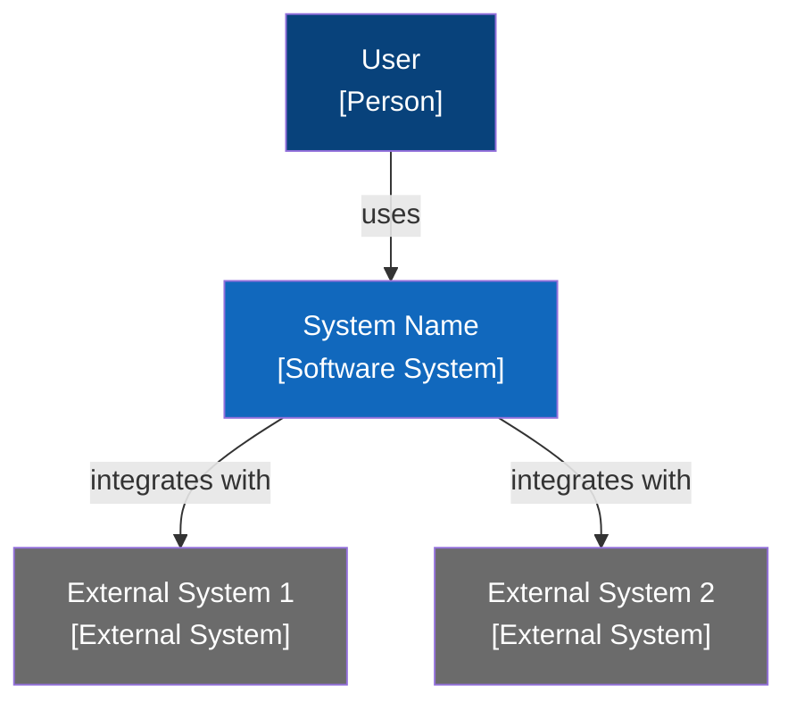

# Category 1 — Product Vision and Context

**Status:** Draft
**Last Updated:** [date]
**Maps to:** Arc42 Chapter 1 + C4 Level 1

---

## What problem does this system solve?

[Derived from VISION.md — one paragraph]

---

## Users and External Systems

| Actor | Type | Role in this system |
|-------|------|---------------------|
| | Person / External System | |

---

## Top Quality Goals

The 3–5 non-functional requirements that drive architectural decisions.
These are not features — they are properties the system must have.

| Priority | Quality Goal | Why it drives the architecture |
|----------|-------------|-------------------------------|
| 1 | | |
| 2 | | |
| 3 | | |

---

## Constraints

Hard constraints the architecture must not violate.

| Constraint | Type | Architectural impact |
|------------|------|----------------------|
| | Legal / Technical / Organizational | |

---

## L1 System Context Diagram

*Replace placeholder names with real system and actor names when filling this document.*

---

## Notes and Clarifications

[Any context that does not fit above but is relevant to this category]
