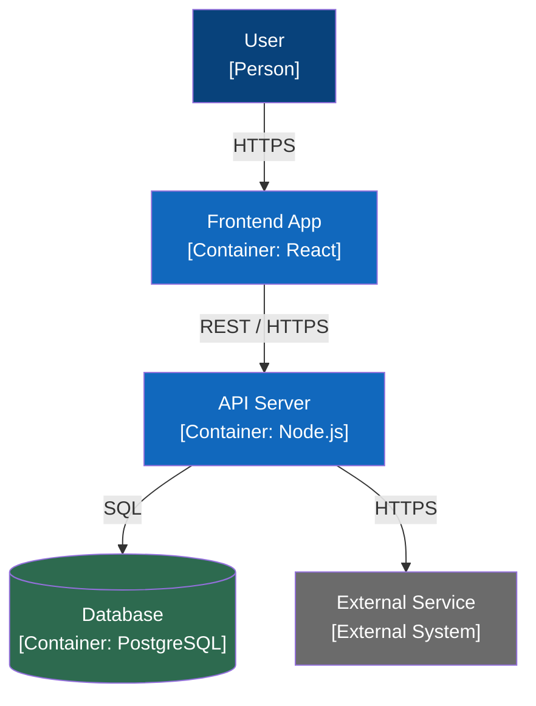

# Category 2 — Architecture Overview

**Status:** Draft
**Last Updated:** [date]
**Maps to:** Arc42 Chapter 4 + C4 Level 2

---

## Top-Level Data Flow

[What is the data flow from input to output? Walk through the system step by step.]

```
Input → [step] → [step] → [step] → Output
```

---

## Deployable Units (Containers)

Each row is a container — an independently deployable unit.

| Container | Technology | Owns | Must NOT own |
|-----------|------------|------|--------------|
| | | | |

---

## Data Ownership

Which layer is the single source of truth for what.

| Data domain | Owner container | Other containers may |
|-------------|----------------|----------------------|
| | | Read only / No access |

---

## Why This Architecture Works

[What failure modes does this architecture prevent? What would break if the boundaries were different?]

---

## L2 Container Diagram



*Replace placeholder names, technologies, and connections with the actual system design.*

---

## Notes and Clarifications

[Any context that does not fit above but is relevant to this category]
