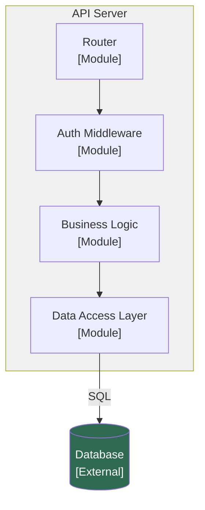

# Category 3 — Service and Module Design

**Status:** Draft
**Last Updated:** [date]
**Maps to:** Arc42 Chapter 5 + C4 Level 3

---

## Internal Modules per Service

For each container defined in Category 2, list its internal modules or domains.

### [Service Name]

| Module | Responsibility | Must NOT do |
|--------|---------------|-------------|
| | | |

### [Service Name]

| Module | Responsibility | Must NOT do |
|--------|---------------|-------------|
| | | |

---

## Inter-Service Communication

| From | To | Protocol | Why this protocol |
|------|----|----------|-------------------|
| | | REST / gRPC / Events / Queue | |

---

## Shared Contracts

Schemas, event types, and enums shared across service boundaries.

| Contract | Type | Owned by | Consumed by |
|----------|------|----------|-------------|
| | Schema / Event / Enum | | |

---

## Dependency Direction Rules

[Which services can import from which? What direction is forbidden?]

- [Service A] may depend on [Service B]
- [Service C] must NOT depend on [Service D]
- Shared packages live in: [location]

---

## Dependency Injection and Service Instantiation

[What pattern governs how services are wired together?]

---

## L3 Component Diagram

*Replace with actual modules and connections for your system.*

---

## Notes and Clarifications

[Any context that does not fit above but is relevant to this category]
