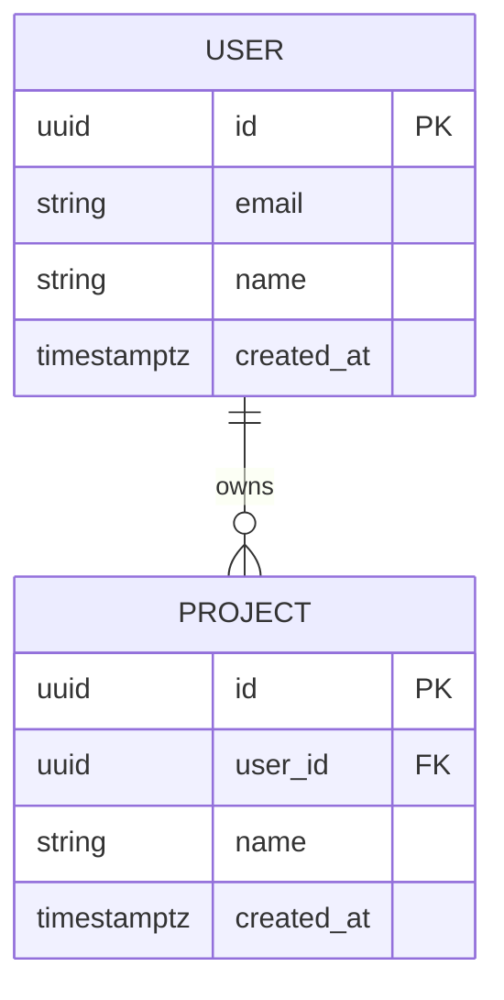

# Category 4 — Data Model

**Status:** Draft
**Last Updated:** [date]
**Maps to:** Arc42 Chapter 9 (data decisions)

---

## Tables and Collections

One section per entity. Include all fields, types, and constraints.

### [Table Name]

| Field | Type | Nullable | Default | Notes |
|-------|------|----------|---------|-------|
| id | uuid | No | gen_random_uuid() | Primary key |
| created_at | timestamptz | No | now() | |
| | | | | |

---

## Relationships

| From table | Relationship | To table | FK field | On delete |
|------------|-------------|----------|----------|-----------|
| | one-to-many / many-to-many | | | CASCADE / RESTRICT / SET NULL |

---

## Indexes

Include non-obvious indexes and explain why each exists.

| Table | Fields | Type | Why |
|-------|--------|------|-----|
| | | btree / gin / gist | |

---

## Enums

| Enum name | Allowed values | Used in |
|-----------|----------------|---------|
| | | |

---

## Known Scaling Limitations

[What are the known limits of this model at MVP vs. at scale?]

---

## What is NOT in the Data Model

[What is explicitly excluded at this stage and why?]

| Excluded entity | Reason | Deferred to |
|----------------|--------|-------------|
| | | Phase [N] |

---

## Entity Relationship Diagram

*Replace with actual entities and relationships for your system.*

---

## Notes and Clarifications

[Any context that does not fit above but is relevant to this category]
