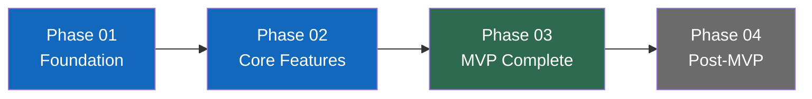
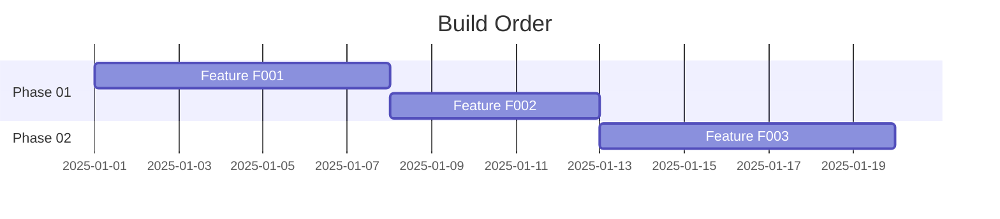

# Category 9 — Build Order and Release Gates

**Status:** Draft
**Last Updated:** [date]

---

## Build Sequence

Feature IDs are assigned here. All feature specs derive their IDs from this table.

| Phase | Feature ID | Description | Unlocks |
|-------|------------|-------------|---------|
| 01 | F001 | | |
| 01 | F002 | | |
| 02 | F003 | | |
| | | | |

---

## Phase Descriptions

One section per phase. Order is deliberate — each phase unlocks the next.

### Phase 01 — [Phase Name]

**Goal:** [What this phase proves or establishes]
**Why first:** [What this phase unlocks for Phase 02]
**Features:** F001, F002

**Release gate — done when:**
- [ ]
- [ ]

**Explicitly NOT in this phase:**
- [item] — deferred to Phase [N]

---

### Phase 02 — [Phase Name]

**Goal:**
**Why this order:** [What Phase 01 must have established before this can begin]
**Features:** F003

**Release gate — done when:**
- [ ]

**Explicitly NOT in this phase:**
-

---

## First Critical Milestone

**Milestone:** [Name]
**Description:** [Minimum to prove the backbone works — what must a user be able to do?]
**Target phase:** Phase [N]

---

## MVP Done Definition

The product is at MVP when:

- [ ]
- [ ]
- [ ]

---

## Phase Roadmap

---

## Gantt View

*Update dates and features when the build order is finalized.*

---

## Notes and Clarifications

[Any context that does not fit above but is relevant to this category]
